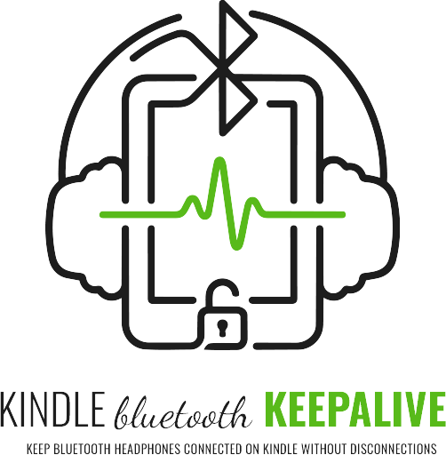

# Kindle Bluetooth Keepalive

<p align="center">
  <picture>
    <source media="(prefers-color-scheme: dark)" srcset="logo/kindle-bt-keepalive-logo-dark.png">
    
  </picture>
</p>

     

Keep your Bluetooth headphones connected on a jailbroken Kindle, without unexpected disconnections caused by screen saver or suspend mode. Features a **KUAL integration** for point-and-click control directly from your Kindle.

Tested on **Kindle Paperwhite 11th Generation, firmware 5.18.5.0.1**.

---

## Features ⚡

- **KUAL Menu Integration**: No more SSH or KTerm needed after setup
- **Get MAC Address**: One-click MAC detection via KUAL menu
- **Three Modes**: Reading Mode, Always On, and Default (Disable)
- **Persistent**: Settings survive reboots via Upstart
- **Zero Configuration**: Single config file with MAC address
- **Pillow Notifications**: Visual feedback on mode changes

---

## Choose Your Mode

| | Reading Mode | Always On |
|---|---|---|
| **Use case** | Reading with BT headphones | Continuous audio playback (iPod Style) |
| **Deep sleep** | ✅ Normal — preserves battery | ⚠️ Deferred — keeps device awake |
| **Reconnect on low battery** | Skipped below threshold | Always attempts |
| **Battery impact** | Minimal | Higher |
| **Recommended for** | Most users | Extended listening sessions |

**Default (Disable)**: Restores Kindle to vanilla state, removes all background processes and Upstart jobs.

---

## Project Structure

```
kindle-bt-keepalive/
├── btkeepalive/              ← Copy to /mnt/us/btkeepalive/
│   ├── always-on/
│   │   └── btconnect.sh
│   ├── reading-mode/
│   │   └── btconnect.sh
│   ├── bin/
│   │   └── btkeepalive_wrapper.sh
│   └── btkeepalive.conf      ← Edit with your MAC
├── extensions/               ← Copy to /mnt/us/extensions/
│   └── btkeepalive/
│       ├── config.xml        ← KUAL extension config
│       ├── menu.json         ← KUAL menu definition
│       ├── get_mac.sh        ← MAC address detection
│       ├── set_reading.sh
│       ├── set_always_on.sh
│       └── set_default.sh
└── logo/                     ← Project assets
```

---

## Prerequisites

- Jailbroken Kindle
- [KUAL](https://wiki.mobileread.com/wiki/KUAL) installed on your Kindle
- SSH access via [kindle-usbnetlite](https://github.com/notmarek/kindle-usbnetlite) or KTerm (only for initial setup)
- [KinAMP](https://github.com/kbarni/KinAMP) by [@kbarni](https://github.com/kbarni) — native music player (optional, but recommended)
- Bluetooth device already paired at least once via the Kindle UI (Settings → Bluetooth)

---

## Installation

### 1. Download and Copy Files

```bash
# On your Kindle via SSH/KTerm:
# Copy btkeepalive/ folder to /mnt/us/btkeepalive/
# Copy extensions/ folder to /mnt/us/extensions/
```

### 2. Configure Your Bluetooth Device

Edit `/mnt/us/btkeepalive/btkeepalive.conf` and replace the MAC address.

**You can edit this file with any text editor:**
- **Windows**: Notepad, Notepad++, VS Code
- **Linux**: gedit, nano, vim, VS Code, Kate
- **macOS**: TextEdit, BBEdit, VS Code, Sublime Text
- **On Kindle**: vi/vim (via SSH/KTerm)

**Find your device MAC:**
- Pair your headphones via Kindle: Settings → Bluetooth
- Click **"Get MAC Address"** in the KUAL Bluetooth Keepalive menu (first menu item)
- A Pillow notification shows your device's MAC address
- Alternatively, via SSH: `lipc-get-prop com.lab126.btfd ConnectedDevices`

**Edit the config file:**
```bash
# Replace MAC="XX:XX:XX:XX:XX:XX" with your device MAC
# Example: MAC="75-c8-28-1a-12-b2"
```

### 3. Launch KUAL

1. Open **KUAL** on your Kindle
2. You'll see **Bluetooth Keepalive** in the menu
3. **First click "Get MAC Address"** (first menu item) to detect your paired device MAC
4. A notification shows: "Device MAC: XX:XX:XX:XX:XX:XX"
5. Copy the MAC and edit `/mnt/us/btkeepalive/btkeepalive.conf` with any text editor
6. Select **Reading Mode** or **Always On**
7. A notification confirms the mode change

---

## Configuration File

Only one file to edit: `/mnt/us/btkeepalive/btkeepalive.conf`

```bash
# MAC address of your Bluetooth headphones
MAC="74:74:46:0F:C0:4B"  # ← Replace with your device MAC

# Minimum battery percentage before allowing sleep (Always On mode only)
THRESHOLD=20

# Log file path (auto-created)
LOGFILE="/mnt/us/btkeepalive/log/btkeepalive.log"
```

---

## How It Works

1. **KUAL Menu Click** → Calls `set_reading.sh` or `set_always_on.sh`
2. **Script Actions**:
   - Writes mode to `config.conf`
   - Installs Upstart job for boot persistence
   - Stops existing processes cleanly
   - Starts new mode immediately
3. **Upstart Service**: `btkeepalive_wrapper.sh` reads mode and launches correct `btconnect.sh`
4. **BT Connection**: Scripts listen for disconnect events and auto-reconnect
5. **Disable**: Removes Upstart job, kills all processes, restores vanilla Kindle

---

## Usage Verification

After selecting a mode, verify with:

```bash
# Check service status
initctl status btkeepalive
# Expected: "btkeepalive start/running, process XXXX"

# Check active processes
ps | grep btconnect

# View logs
tail -f /mnt/us/btkeepalive/log/wrapper.log
tail -f /mnt/us/btkeepalive/log/btkeepalive.log
```

---

## Acknowledgements

- [**@notmarek**](https://github.com/notmarek) — for [kindle-usbnetlite](https://github.com/notmarek/kindle-usbnetlite), a lightweight SSH solution for Kindle.
- [**@kbarni**](https://github.com/kbarni) — for [KinAMP](https://github.com/kbarni/KinAMP), a native music player for Kindle that works beautifully on e-ink displays.
- [**KUAL Team**](https://wiki.mobileread.com/wiki/KUAL) — for the Kindle Unified Application Launcher.

---

## Rationale & Inspiration 🍃

For me, reading is far more than a mere intellectual exercise; it is a profoundly immersive ritual. There is an unparalleled serenity in losing oneself within the pages of a book while enveloped by the rhythmic cadence of **falling rain** or the evocative symphony of a **secluded woodland**.

This project was born out of a necessity to preserve that very atmosphere. I discovered that the Kindle's power-saving measures often sever the Bluetooth connection during periods of sonic subtlety, abruptly shattering the immersion. This script is a modest endeavor, conceived for **educational purposes and personal exploration**, to ensure that the whisper of the forest or the patter of the rain remains uninterrupted.

---

## ⚠️ Disclaimer

**This project is strictly the result of academic study and personal experimentation.**

The author **disclaims all responsibility** for any potential hardware or software damage, data loss, or the voiding of device warranties that may arise from the use or installation of this software. By utilizing this script, the user acknowledges and accepts all associated risks. This software is provided "as is," without any guarantees of performance or stability.

---

## 📄 License

This project is licensed under the [MIT License](https://github.com/imanubdesigner/kindle-bt-keepalive?tab=MIT-1-ov-file#readme) - see the LICENSE file for details.
